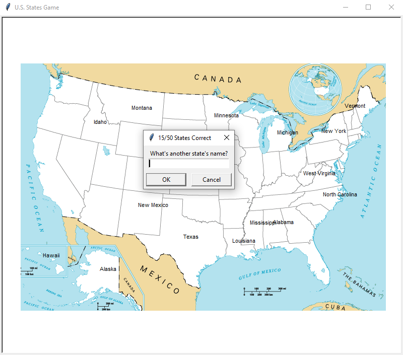

# U.S. States Game

Welcome to the U.S. States Game! This is an interactive game that helps you learn the names of the 50 states in the United States. Guess the names of the states and see them appear on the map!

## How to Play
1. You will be prompted to guess the names of the U.S. states.
2. Type the name of a state and press Enter.
3. If you guess correctly, the state will be marked on the map.
4. Keep guessing until you've guessed all 50 states or type "Exit" to end the game.
5. After the game ends, a list of states you missed will be saved to a file called `states_to_learn.csv`.

## Features
- Interactive map: guess the states and see them appear on the map.
- Educational: learn the names of the 50 states while having fun.
- Save progress: review the states you missed and learn them for next time.

## Files
- `50_states.csv`: CSV file containing the names and coordinates of the 50 states.
- `blank_states_img.gif`: Image file of the blank U.S. map.
- `states_to_learn.csv`: CSV file to save the states you missed for review.

## Usage
1. Run the `main.py` file using a Python interpreter.
2. Type the name of a state and press Enter.
3. Continue guessing until you've guessed all 50 states or type "Exit" to end the game.

## Screenshots

## Credits
- Developed by [Supun Wickramarachchi](https://github.com/supunwickramarachchi).
- Inspired by geography learning games.

Enjoy playing and learning about the U.S. states!

Feel free to customize this game or add more features to enhance the learning experience.
